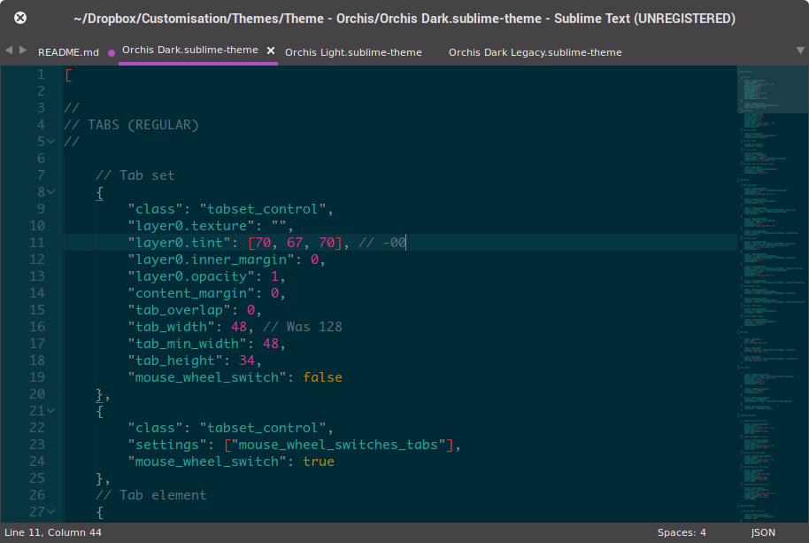

# Orchis Sublime Text Theme

A set of custom UI themes for Sublime Text 2/3  that match [Orchis GTK+ theme](http://mokaproject.com/orchis-gtk-theme/), based on [Spacegray](https://github.com/kkga/spacegray).

***

### Themes

#### Orchis Light

Default flavour.


#### Orchis Dark

Dark variation.



*The font used in the screenshots is __Droid Sans__; the colour scheme, __Monokai__.*

***

### How to Install

#### Via Package Control

The easiest way to install is using [Sublime Package Control](https://sublime.wbond.net), where Orchis is listed as `Theme - Orchis`.

1. Open Command Palette using menu item `Tools -> Command Palette...` (Ctrl + Shift + P).
2. Choose `Package Control: Install Package`
3. Find `Theme - Orchis` and hit Enter

#### Manual

You can also install the theme manually:

1. [Download the .zip](https://github.com/aldomann/sublime-orchis/archive/master.zip)
2. Unzip and rename the folder to `Theme - Orchis`
3. Copy the folder into `Packages` directory, which you can find using the menu item `Sublime Text -> Preferences -> Browse Packages...`

***

### How to Activate

Activate the UI theme and color scheme by modifying your user preferences file, which you can find using the menu item `Sublime Text -> Preferences -> Settings - User`.

You can choose whichever flavor you like, but don't forget to change *both* color scheme and UI theme so they match.

***Note: Don't forget to restart Sublime Text after activating the theme.***

#### Settings for Orchis Dark

```
{
  "theme": "Orchis Dark.sublime-theme"
}
```

#### Settings for Orchis Light

```
{
  "theme": "Orchis Light.sublime-theme"
}
```
